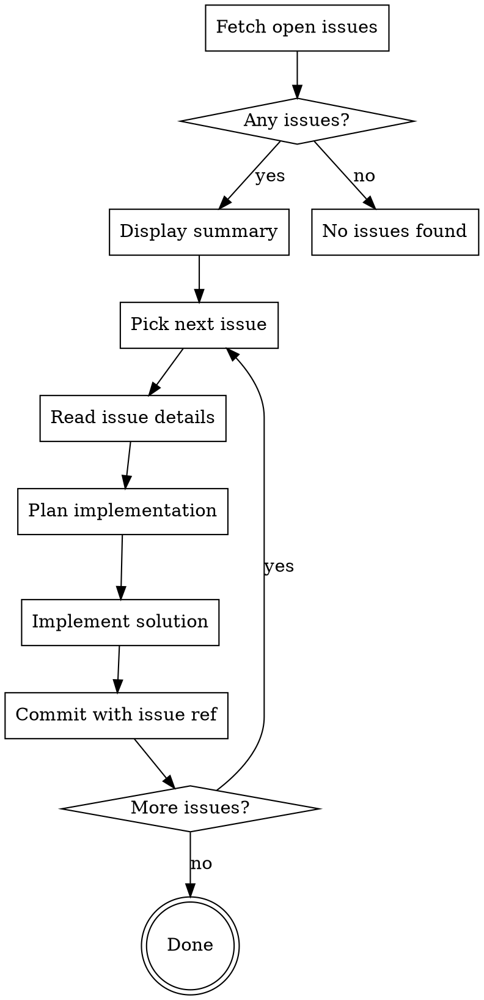

# Pull Issues

Pull open GitHub issues from the current repository and work through them sequentially, implementing each one.

## Workflow



## Steps

### 1. Fetch Issues

```bash
gh issue list --state open --json number,title,body,labels --limit 50
```

### 2. Display Summary

Show the user a numbered list of all open issues with their titles before starting work.

### 3. For Each Issue

1. **Read details**: `gh issue view <number>`
2. **Plan**: Use brainstorming skill if needed for complex features
3. **Implement**: Write the code, following project conventions
4. **Test**: Run relevant tests if they exist
5. **Commit**: Reference issue in commit message

```bash
git commit -m "feat: <description>

Closes #<issue-number>"
```

### 4. After All Issues

Report summary of what was completed.

## Commit Message Format

- `feat:` for new features
- `fix:` for bug fixes
- `docs:` for documentation
- `refactor:` for refactoring

Always include `Closes #<number>` or `Fixes #<number>` to auto-close the issue when merged.

## Notes

- If an issue is unclear, ask for clarification before implementing
- For large issues, consider creating a plan first
- Skip issues that require external dependencies or permissions you don't have
